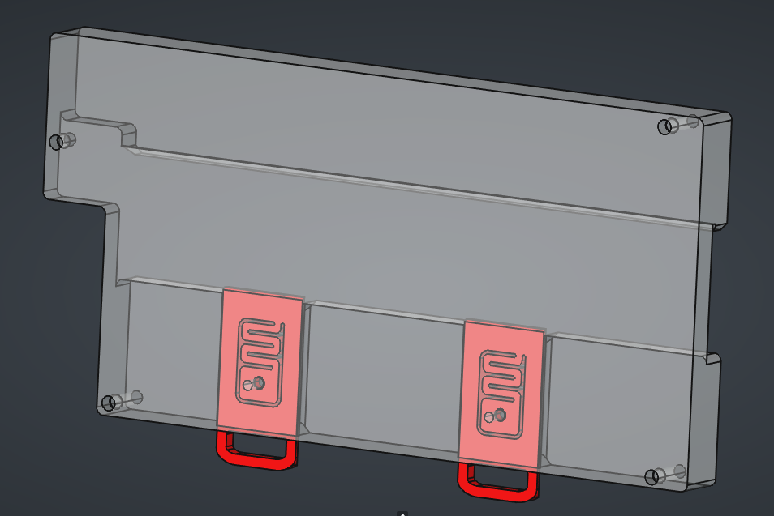

# FlexiHAL 2350 DIN Rail Mount

## Bill of materials

- 1x [Mainplate](./CAD/flexi2350_mount-mainplate.stl) 3D print.
- 2x [Retaining clip](./CAD/flexi2350_mount-clip.stl) 3D print.
- M3 hex standoffs and screws, E.G.: [this kit](https://www.adafruit.com/product/4685).
- 4x M3 threaded inserts, E.G.: [These ones](https://cnckitchen.store/products/heat-set-insert-m3-x-3-short-version-100-pieces).
- 2x M3 flat head screw, 8mm long.
